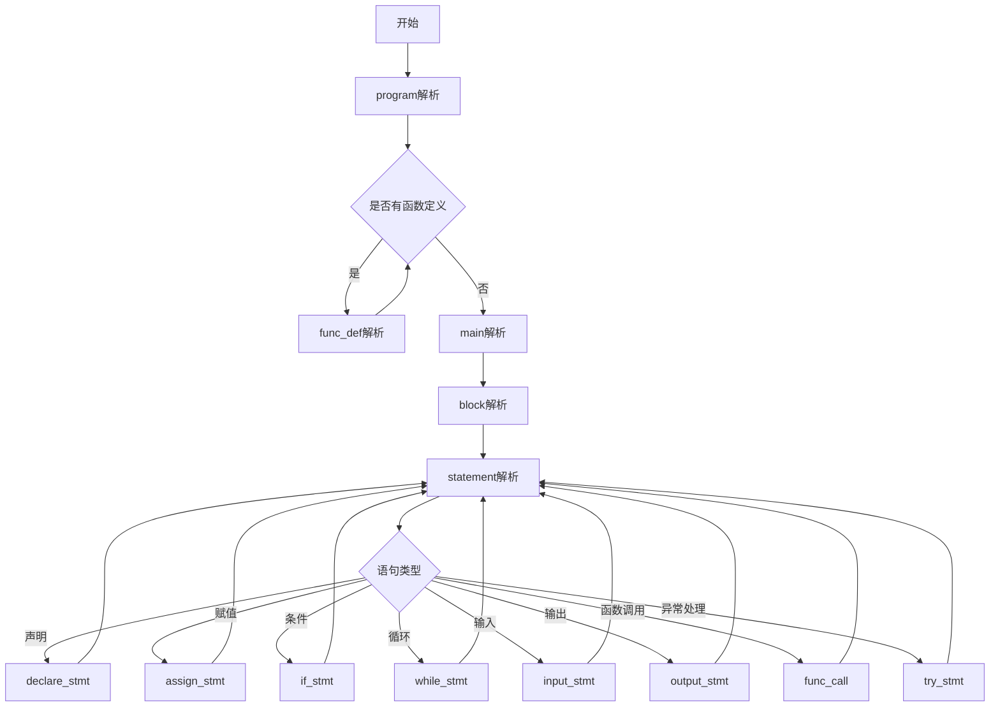

# L25 编译器说明文档

## 1. 概述

L25 编译器是基于 PL/0 编译器实现的修改版本，支持 L25 语言的编译和执行。该编译器实现了词法分析、语法分析、语义分析、代码生成和解释执行等功能，并完成了第四组的扩展要求——引入 try-catch 异常处理机制。

## 2. l25文法定义

L25 语言规范规定了以下文法（使用 EBNF 描述）：

```ebnf
<program> = "program" <ident> "{" { <func_def> } "main" "{" <stmt_list> "}" "}"

<func_def> = "func" <ident> "(" [ <param_list> ] ")" "{" <stmt_list> "return" <expr> ";" "}"

<param_list> = <ident> {"," <ident> }

<stmt_list> = <stmt> ";" { <stmt> ";" }

<stmt> = <declare_stmt> | <assign_stmt> | <if_stmt> | <while_stmt> | <input_stmt>
         | <output_stmt> | <func_call> | <try_stmt>  // 新增try语句

<declare_stmt> = "let" <ident> ["=" <expr> ]

<assign_stmt> = <ident> "=" <expr>

<if_stmt> = "if" "(" <bool_expr> ")" "{" <stmt_list> "}" ["else" "{" <stmt_list> "}"]

<while_stmt> = "while" "(" <bool_expr> ")" "{" <stmt_list> "}"

<try_stmt> = "try" "{" <stmt_list> "}" "catch" "{" <stmt_list> "}"  // 新增try-catch结构

<func_call> = <ident> "(" [ <arg_list> ] ")"

<arg_list> = <expr> {"," <expr> }

<input_stmt> = "input" "(" <ident> {"," <ident> } ")"

<output_stmt> = "output" "(" <expr> {"," <expr> } ")"

<bool_expr> = <expr> ("==" | "!=" | "<" | "<=" | ">" | ">=") <expr>

<expr> = ["+" | "-"] <term> {("+" | "-") <term>}

<term> = <factor> {("*" | "/") <factor>}

<factor> = <ident> | <number> | "(" <expr> ")" | <func_call>

<ident> = <letter> {<letter> | <digit>}

<number> = <digit> {<digit>}

<letter> = "a" | "b" | ... | "z" | "A" | "B" | ... | "Z"

<digit> = "0" | "1" | ... | "9"
```

## 3. 编译器结构

### 3.1 主要组件

1. **词法分析器 (lexical analyzer)**

   - 负责识别源代码中的各种符号（保留字、标识符、数字、运算符等）
   - 主要函数：`getsym()`, `getch()`

2. **语法分析器 (parser)**

   - 使用递归下降法分析语法结构
   - 主要函数：`program()`, `parse_function_header()`, `block()`, `statement()`, `expression()`, `term()`, `factor()`

3. **符号表管理 (symbol table)**

   - 存储变量、函数等标识符信息
   - 结构：`struct tablestruct`
   - 主要函数：`enter()`, `position()`

4. **代码生成器 (code generator)**

   - 生成虚拟机指令
   - 主要函数：`gen()`

5. **虚拟机 (virtual machine)**

   - 解释执行生成的指令
   - 主要函数：`interpret()`

6. **异常处理 (exception handling)**
   - 实现 try-catch 机制
   - 主要函数：`statement()`中的 try-catch 处理部分

### 3.2 新增关键特性

#### try-catch 实现

```c
else if (sym == trysym) {
    getsym(); /* 跳过 try */

    /* 生成 "pushC" 占位 */
    int litIdx = cx;
    gen(lit, 0);
    gen(opr, 19); /* 19: pushC */

    /* 解析 try { ... } */
    if (sym != lbrace) error(34);
    getsym();

    /* ... 解析try块中的语句 ... */

    /* try正常执行完，跳过catch */
    gen(opr, 20); /* 20: popC */
    int jmpIdx = cx;
    gen(jmp, 0); /* 稍后回填到catch之后 */

    /* 解析 catch { ... } */
    if (sym != catchsym) error(88);
    getsym();

    int catchStart = cx;         /* catch起始地址 */
    code[litIdx].a = catchStart; /* 回填lit地址 */

    /* ... 解析catch块中的语句 ... */

    gen(opr, 20); /* 20: popC */

    /* 回填"跳过catch" */
    code[jmpIdx].a = cx;
}
```

#### 除法异常处理

```c
case 5: /* 除法 */
    if (s[t] == 0) {
        printf("** Runtime Error: Division by zero\n");
        fprintf(fresult, "** Runtime Error: Division by zero\n");

        if (cTop > 0) {
            p = catchStack[cTop]; /* 跳转到catch */
            t--;                  /* 丢弃try内部残留表达式 */
        } else {
            exit(1); /* 没有catch处理 */
        }
    } else {
        t--;
        s[t] = s[t] / s[t + 1];
    }
    break;
```

## 4. 语法分析详解
### 4.1 总体流程


### 4.2 核心函数

#### 4.2.1 program解析
- **功能**：解析整个程序结构
- **文法规则**：
  ```ebnf
  <program> = "program" <ident> "{" { <func_def> } "main" "{" <stmt_list> "}" "}"
  ```
- **处理流程**：
   1. 匹配`program`关键字
   2. 匹配程序名标识符
   3. 匹配`{`
   4. 循环解析函数定义(func_def)
   5. 匹配`main`
   6. 解析主程序块(block)
   7. 匹配`}`

```c
void program(bool *fsys) {
    // ...
    if (sym != progsym) error(40);
    getsym();
    
    if (sym != ident) error(1);
    getsym();
    
    if (sym != lbrace) error(23);
    getsym();
    
    // 解析函数定义
    while (sym == funcsym) {
        parse_function_header(funcFollow);
    }
    
    // 解析main块
    if (sym != mainsym) error(41);
    getsym();
    block(&tx, topFollow, 0, NULL);
    // ...
}
```

#### 4.2.2 func_def解析
- **功能**：解析函数定义
- **文法规则**：
  ```ebnf
  <func_def> = "func" <ident> "(" [ <param_list> ] ")" "{" <stmt_list> "return" <expr> ";" "}"
  ```
- **处理流程**：
   1. 匹配`func`关键字
   2. 匹配函数名标识符
   3. 将函数加入符号表
   4. 解析参数列表(param_list)
   5. 解析函数体(block)
   6. 确保有return语句

```c
void parse_function_header(bool *fsys) {
    getsym(); // 跳过 'function'
    
    if (sym != ident) error(1);
    curFuncIdx = enter(function, &tx, &dx);
    getsym(); // 跳过函数名
    
    block(&tx, fsys, 1, &paramCnt); // 解析函数体
    table[curFuncIdx].paramCnt = paramCnt;
}
```

#### 4.2.3 block解析
- **功能**：解析语句块
- **处理流程**：
   1. 为函数生成跳转指令占位（仅函数）
   2. 解析形参列表（仅函数）
   3. 匹配`{`
   4. 循环解析语句(statement)
   5. 解析return语句（仅函数）
   6. 匹配`}`
   7. 回填入口地址
   8. 生成结束指令

```c
void block(int *ptx, bool *fsys, int isFunc, int *retParamCnt) {
    // ...
    if (isFunc) {
        cx0 = cx;
        gen(jmp, 0); // 预留跳转
    }
    
    // 解析形参
    if (isFunc && retParamCnt) {
        // ...
    }
    
    if (sym != lbrace) error(34);
    getsym();
    
    // 解析语句列表
    while (inset(sym, statbegsys)) {
        statement(inside, ptx, &dx);
        if (sym == semicolon) getsym();
    }
    
    // 函数必须包含return
    if (isFunc) {
        if (sym != returnsym) error(50);
        getsym();
        expression(exprFollow, ptx);
        gen(sto, 2); // 存储返回值
    }
    
    if (sym != rbrace) error(24);
    getsym();
    
    // 回填地址&生成结束指令
    if (isFunc) {
        code[cx0].a = ini_pos;
        gen(opr, 18); // return
    } else {
        gen(opr, 0); // 结束
    }
}
```


## 5. 栈操作详解

### 5.1 虚拟机栈结构

L25 编译器使用栈式虚拟机，包含以下栈：

1. **数据栈 (s)**

   - 存储运行时数据（变量值、临时结果等）
   - 大小：`stacksize`（默认为 500）

2. **异常处理栈 (catchStack)**
   - 存储 try-catch 块信息
   - 结构：`int catchStack[stacksize]`
   - 指针：`cTop`（栈顶指针）

### 5.2 关键栈操作

#### 函数调用时的栈操作

1. **调用函数 (CAL 指令)**

   ```c
   case cal:          /* 调用子过程 */
       s[t + 1] = b;  /* 保存当前基址 (动态链) */
       s[t + 2] = p;  /* 保存返回地址 */
       s[t + 3] = 0;  /* 返回值槽 */
       b = t + 1;     /* 新基址 */
       p = i.a;       /* 跳转到函数入口 */
       break;
   ```

2. **函数返回 (OPR 0)**
   ```c
   case 0: /* 函数返回 */
       t = b - 1;    /* 恢复栈顶 */
       p = s[t + 3]; /* 恢复指令指针 */
       b = s[t + 2]; /* 恢复基址 */
       break;
   ```

#### try-catch 的栈操作

1. **进入 try 块**

   - 生成`pushC`指令 (OPR 19)
   - 将 catch 块地址压入异常处理栈

   ```c
   gen(opr, 19); /* pushC */
   ```

2. **正常执行 try 块**

   - 无异常时执行完 try 块内容
   - 生成`popC`移除异常处理栈顶

   ```c
   gen(opr, 20); /* popC */
   ```

3. **发生异常**

   - 除零错误发生时：

   ```c
   if (cTop > 0) {
       p = catchStack[cTop]; /* 跳转到catch */
       t--; /* 丢弃当前表达式结果 */
   }
   ```

4. **执行 catch 块**
   - 执行异常处理代码
   - 最后`popC`移除异常处理记录
   ```c
   gen(opr, 20); /* popC */
   ```

### 5.3 栈状态示例

**正常执行 try 块后栈状态：**

```
[数据栈] [其他数据] [try块结果]
[异常栈] ... (popC后cTop减少)
```

**发生异常时栈状态：**

```
[数据栈] [其他数据] [除零错误位置]
[异常栈] ... [最近的catch地址] (cTop指向)
```

**进入 catch 块后栈状态：**

```
[数据栈] [其他数据] (错误位置被丢弃)
[异常栈] ... (cTop减少)
```

## 6. 使用说明

### 6.1 编译编译器

```bash
gcc l25Compiler.c -o l25Compiler
```

### 6.2 运行编译器

```bash
./l25Compiler
```

程序会提示：

1. 输入 L25 源文件名
2. 是否输出虚拟机代码 (Y/N)
3. 是否输出符号表 (Y/N)

### 6.3 输出文件

| 文件名      | 内容描述                        |
| ----------- | ------------------------------- |
| foutput.txt | 源文件、错误信息和代码地址      |
| ftable.txt  | 符号表信息                      |
| fcode.txt   | 生成的虚拟机代码 (如果选择输出) |
| fresult.txt | 程序运行结果                    |

### 6.4 示例测试
#### （注：文件中输出了所有栈，为方便查看，测试结果将栈隐藏）

#### 测试用例 1: 阶乘（递归）

```l25
program DFS{
    func jie(n){
        let res = 0;
        if(n == 1){
            res = 1;
        }else{
            res = n * jie(n-1);
        };
        return res;
    }
    main {
        let a;
        input(a);
        output(jie(a));
    }
}
```

**输出：**


#### 测试用例 2: 最大公约数

```l25
program GCD {
    func gcd(a, b) {
        let res;
        if (b == 0) {
            res = a;
        } else {
            let mod = a - b * (a / b);
            res = gcd(b, mod);
        };
        return res;
    }
    main {
        let x;
        let y;
        input(x, y);
        output(gcd(x, y));
    }
}
```

**输出：**


#### 测试用例 3: 要求文档MyApp（函数调用）

```l25
program MyApp { 
    func add(a, b) {
        let sum = a + b;
        return sum;
    } 
    func square(x) { 
        let result = x * x;
        return result; 
    } 
    main {
        let x = 5;
        let y = add(x, 10);
        let z = square(y); 
        if (z > 50) {
            output(z); 
        } else {
            output(0); 
        };
    }
}
```

**输出：**


#### 测试用例 4: 除法除以零及正常除法

```l25
program TryCatchDemo {
    func divide(x, y) {
        let result = 0;
        try {
            result = x / y;
        } catch {
            result = -1;
        }
        return result;
    }

    main {
        let a = 10;
        let b = 0;
        let c = 0;
        c = divide(a, b);
        output(c);

        b = 2;
        c = divide(a, b);
        output(c);

        try {
            c = a / b;
            output(c);
        } catch {
            output(-2);
        }


        output(0);
    }
}
```

**输出：**


## 7. 实现细节

### 7.1 异常处理机制

1. **try 块开始**

   - 生成`lit 0`占位指令
   - 生成`opr 19`(pushC)指令
   - 记录 catch 块地址位置

2. **catch 块处理**

   - 回填 try 块中的`lit`指令地址
   - 生成异常处理代码
   - 结束时生成`opr 20`(popC)

3. **异常发生**
   - 除法指令检查除数为零
   - 如果有 catch 块，跳转到 catch 地址
   - 清除当前栈顶的临时值

### 7.2 符号表管理

| 字段     | 描述                           |
| -------- | ------------------------------ |
| name     | 标识符名称                     |
| kind     | 类型 (variable/param/function) |
| adr      | 地址/偏移量                    |
| size     | 数据区大小 (函数)              |
| paramCnt | 参数个数 (函数)                |
| attr     | 属性标志 (bit0=isParam)        |

### 7.3 虚拟机指令集

| 指令 | 参数 | 功能描述                   |
| ---- | ---- | -------------------------- |
| LIT  | a    | 加载常量 a 到栈顶          |
| OPR  | a    | 算术/逻辑操作 (见下表)     |
| LOD  | a    | 加载变量到栈顶             |
| STO  | a    | 栈顶值存入变量             |
| CAL  | a    | 调用函数                   |
| INI  | a    | 分配数据区空间             |
| JMP  | a    | 无条件跳转                 |
| JPC  | a    | 条件跳转 (栈顶为 0 时跳转) |

**OPR 操作码：**

| 代码 | 操作              |
| ---- | ----------------- |
| 0    | 返回              |
| 1    | 取负              |
| 2    | 加法              |
| 3    | 减法              |
| 4    | 乘法              |
| 5    | 除法              |
| 8    | 等于判断          |
| 9    | 不等于判断        |
| 10   | 小于判断          |
| 11   | 大于等于判断      |
| 12   | 大于判断          |
| 13   | 小于等于判断      |
| 14   | 输出栈顶值        |
| 16   | 输入整数到栈顶    |
| 17   | 参数传递          |
| 18   | 函数返回          |
| 19   | pushC (try 开始)  |
| 20   | popC (catch 结束) |

## 8. 总结

L25 编译器在 PL/0 的基础上进行了多项扩展，特别是实现了 try-catch 异常处理机制。通过精心设计的栈操作和指令集扩展，编译器能够在运行时捕获除零错误并跳转到相应的异常处理代码块。

编译器的主要特点：

1. 完整的 L25 语言支持，包括函数、控制结构等
2. 栈式虚拟机实现
3. 异常处理机制
4. 错误报告和调试信息
5. 可选的代码和符号表输出

通过四个测试用例的验证，编译器能够正确处理各种正常和异常情况，符合第四组的扩展要求。
